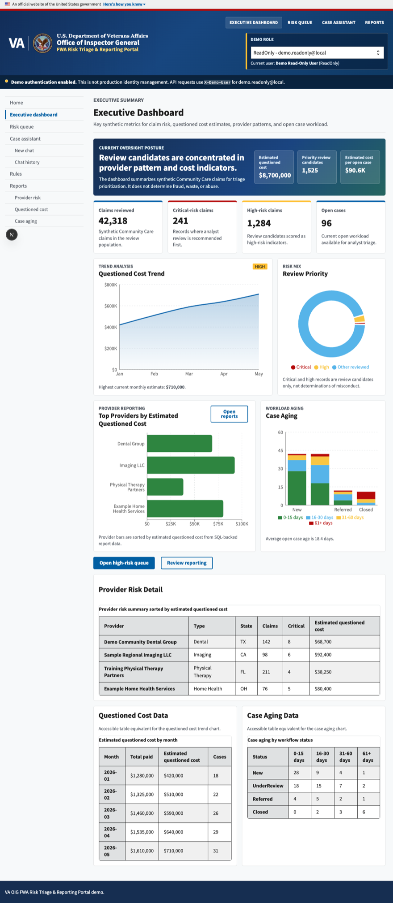
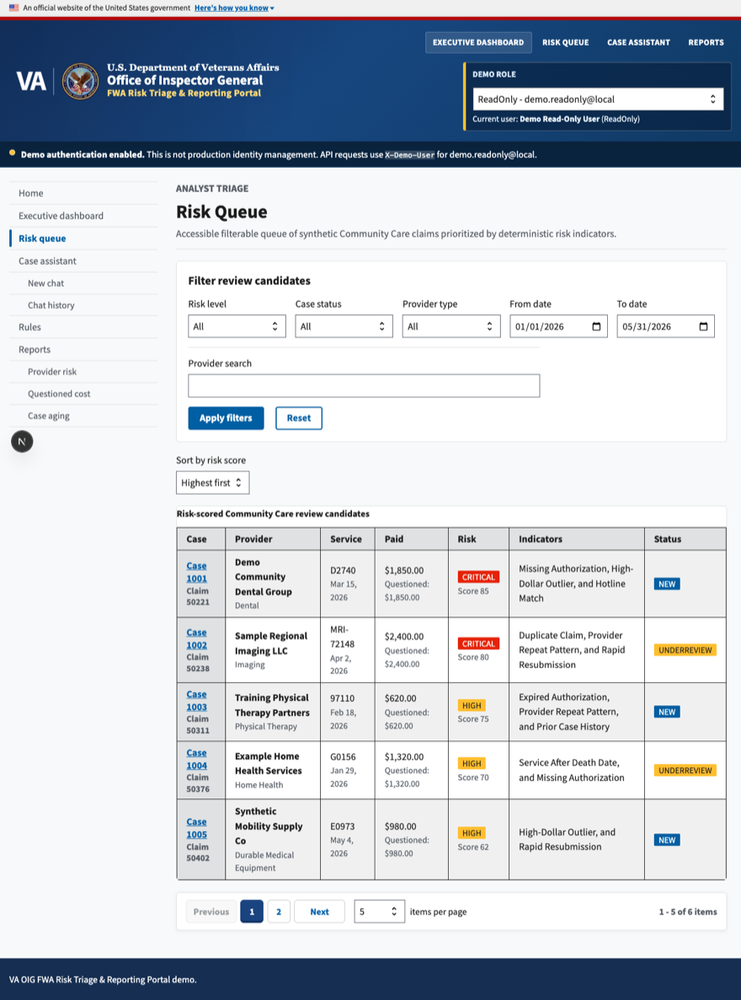
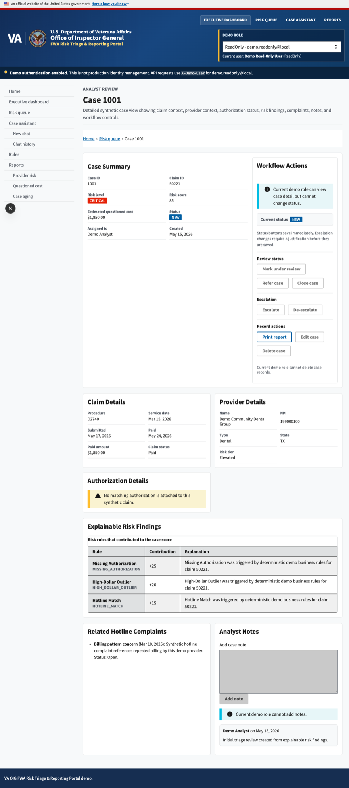
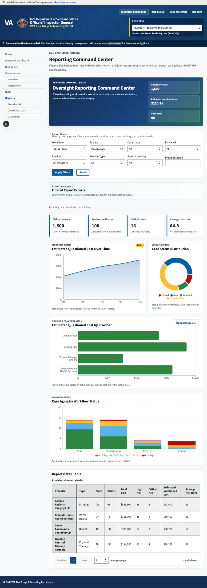
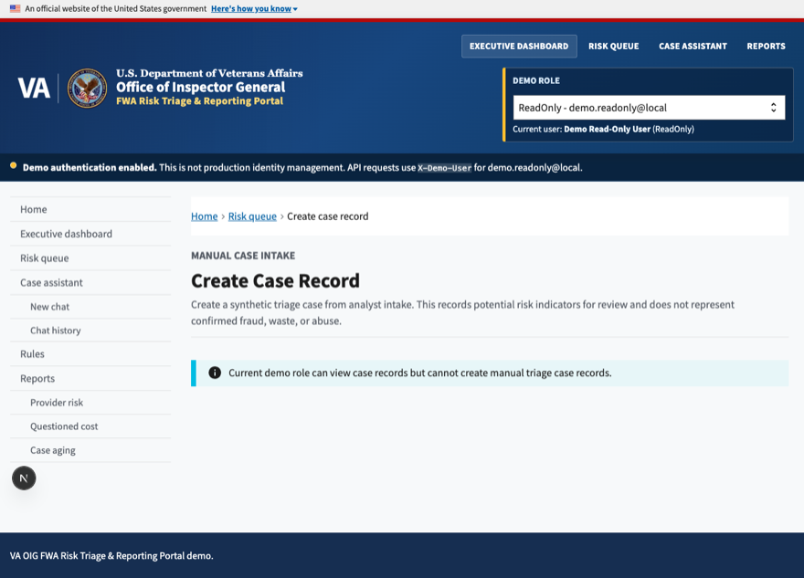
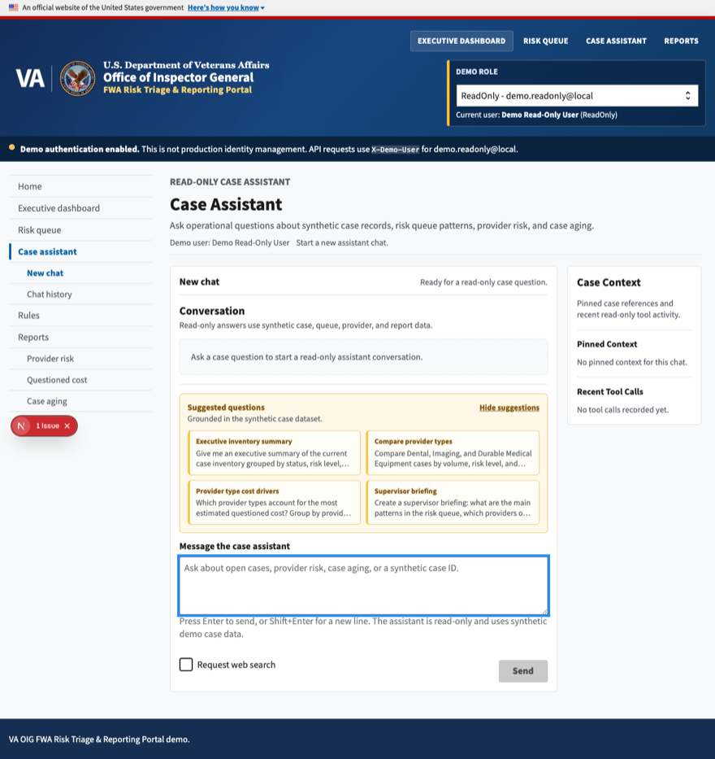
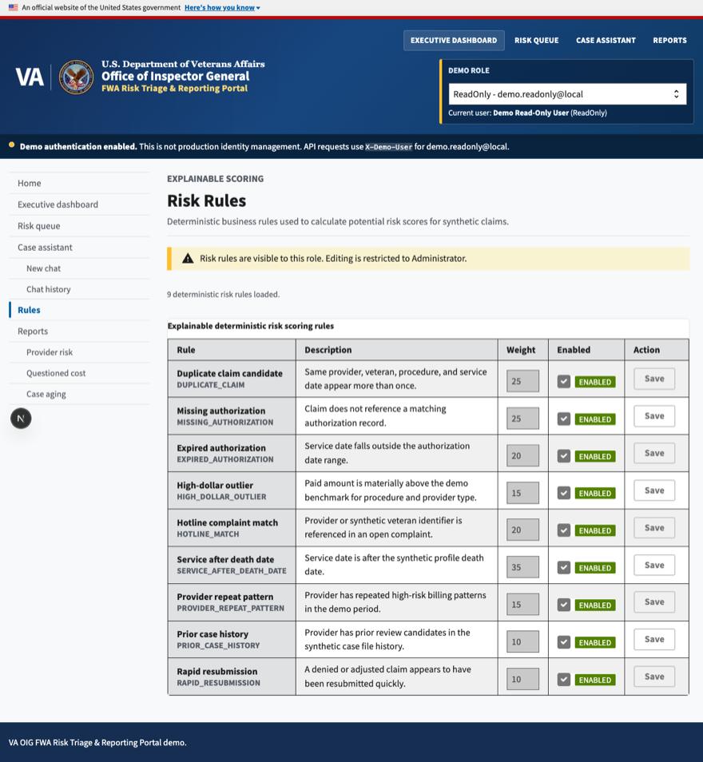
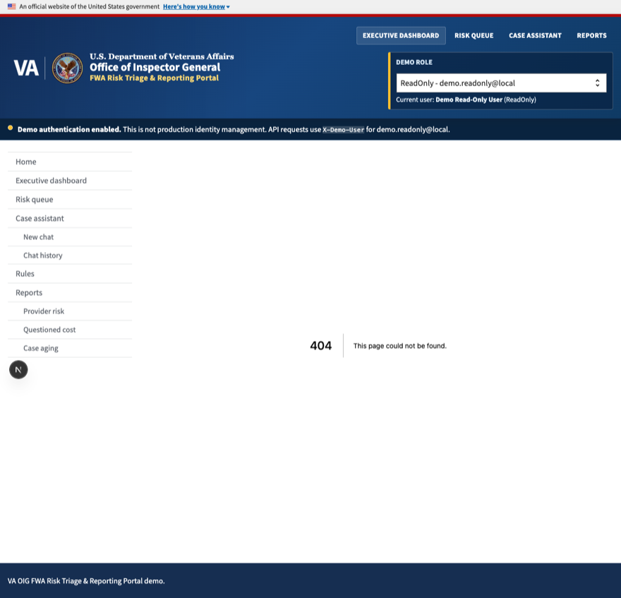
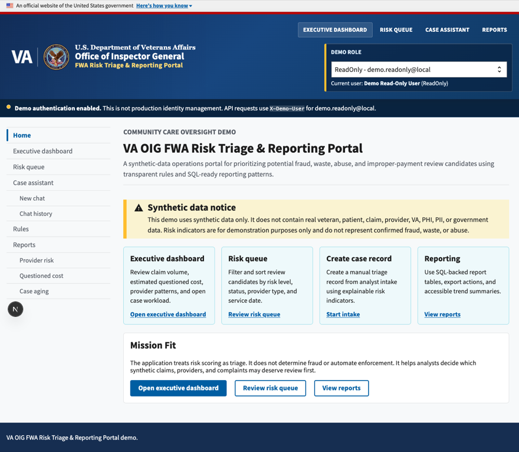

# VA OIG FWA Risk Triage & Reporting Portal

**A synthetic-data demo that helps VA OIG analysts decide which Community Care claims, providers,
complaints and cases deserve review first, using transparent rules and SQL-backed reporting.**

[](https://github.com/Alex5350/USWDS-VA-Demo/actions/workflows/ci.yml)

> **Synthetic data only.** This demo does not contain real veteran, patient, claim, provider, VA,
> PHI, PII, or government data. Risk indicators are for demonstration purposes only and do not
> represent confirmed fraud, waste, or abuse.

This application does not determine fraud. It helps analysts prioritize claims, providers,
complaints, and case work that may deserve review based on transparent business rules and
SQL-backed reporting.

> **Two ways to read this page.** Not an engineer? Everything below the pictures stays in plain
> language, and jargon links to the [glossary](docs/GLOSSARY.md). Engineer? The deep dive lives in
> [TECHNICAL.md](TECHNICAL.md): architecture, request flow, and every major decision mapped back
> to the business problem it solves.

## The problem

VA Office of Inspector General analysts who watch the Community Care program face large volumes
of claims, authorizations, provider records, hotline complaints and open cases. Reviewing every
record equally is impossible, so attention has to be allocated somehow. When it is allocated
badly, two things go wrong: improper payments slip through unnoticed, or a provider gets drawn
into a process that reads as accusation. A triage tool in this domain has to respect both risks
at once.

This portal is a synthetic-data demo of one approach: rank the workload so an analyst can see
which records most deserve review, show why each record surfaced, and keep the language careful
throughout. [Risk indicators](docs/GLOSSARY.md) here are prioritization signals, not
[fraud determinations](docs/GLOSSARY.md); the application does not determine fraud, and the
synthetic-data notice appears on every page that displays data.

Walking someone through this live? [docs/DEMO-SCRIPT.md](docs/DEMO-SCRIPT.md) opens with the
business case and closes by mapping the demo to the VA OIG Office of Data and Analytics mission.

## The product in pictures

Captured from the running client (real browser, keyboard-verified pages) with its embedded
offline dataset, the same interface you get from `bun run dev` alone:

| See the day at a glance: claims reviewed, risk counts, questioned cost, open cases | Work a ranked queue: filter to the records that deserve review first |
|:---:|:---:|
|  |  |

| Ask "why did this surface?" and get the rule and the explanation | Brief leadership: filtered reports with CSV and print-to-PDF export |
|:---:|:---:|
|  |  |

| Capture a new review candidate with searchable reference data | Ask the read-only assistant to summarize the caseload |
|:---:|:---:|
|  |  |

| Inspect the rules behind every score | Show who-can-do-what: demo roles, overrides, audit events |
|:---:|:---:|
|  |  |

<p align="center"></p>

## What it delivers

- **A ranked queue, not an accusation.** Records surface with the rule that flagged them; every
  risk finding carries a human-readable explanation, and escalation requires a persisted
  justification. Risk indicators are prioritization signals, never fraud determinations.
- **Reporting an analyst can defend.** Executive metrics, provider concentration, questioned
  cost trends and case aging all come from named [SQL views and stored
  procedures](docs/REPORTING.md); estimated questioned cost is an indicator that helps set
  priorities, never a verdict.
- **Accessible by law and by design.** [Section 508](docs/GLOSSARY.md) expectations on a
  [USWDS](docs/GLOSSARY.md) foundation: keyboard-complete flows, labeled forms, visible focus,
  text and table alternatives for every chart, no color-only meaning, and respect for
  reduced-motion preferences.
- **An assistant that summarizes but cannot touch.** The AI case assistant answers questions
  about the synthetic caseload through read-only tools; it cannot create, edit, escalate or
  delete anything, and it never replaces analyst judgment.
- **Who-can-do-what on display.** Role-based mock authentication, from ReadOnly to
  Administrator, makes the authorization model visible: deletions go to a restore-capable bin
  and audit events record administrative actions.
- **A demo that runs anywhere.** `bun run dev` alone renders the fully navigable portal from an
  embedded offline dataset; the live path adds SQL Server, the .NET API and reporting.

## How the engineering solves it

Plain-terms bridge; each item links to the full story in [TECHNICAL.md](TECHNICAL.md).

- **Accessibility here is a legal and human requirement, not a coat of paint.** The design
  system choice itself (USWDS 3.x plus a written Section 508 contract every page is held to)
  bakes it in, and accessibility bugs are treated as defects with commits
  ([ADR 0002](docs/adr/0002-uswds-accessibility-first.md)).
- **The worst AI failure must be a wrong summary, not a wrong record.** The assistant can only
  read and summarize through allowlisted tools over existing services, so a bad generation can
  mislead a briefing but cannot mutate a case, and summaries cite the case data they grouped
  ([ADR 0005](docs/adr/0005-ai-assistant-boundary.md)).
- **A demo that dies without infrastructure helps nobody.** Every client data call goes through
  one gateway that tries the API first and falls back to an embedded, typed dataset (the risk
  queue even filters and paginates locally), so a reviewer sees the product in one command
  ([ADR 0004](docs/adr/0004-client-offline-fallback.md)).
- **Report numbers must be explainable row by row.** Reports are read-only analytics over a
  normalized SQL model: named views and parameterized stored procedures reached through Dapper,
  with EF Core handling transactional writes, so any figure in a report traces to SQL a
  reviewer can open ([ADR 0001](docs/adr/0001-clean-architecture-hybrid.md),
  [docs/REPORTING.md](docs/REPORTING.md)).

<details>
<summary><b>For developers: quickstart</b></summary>

The full path, including Windows and macOS notes, database bootstrap, the assistant key and
troubleshooting, lives in [docs/SETUP.md](docs/SETUP.md). The essence:

```bash
git clone https://github.com/Alex5350/USWDS-VA-Demo.git
cd USWDS-VA-Demo
docker compose up -d sqlserver     # SQL Server 2022; then run the three setup scripts
dotnet run --project src/server/VAOIG.FwaRiskTriage.Api
cd src/client && bun install && bun run dev   # http://localhost:3000
```

`bun run dev` alone renders the full portal from the embedded offline dataset; the commands
above stand up the live SQL-backed path.

</details>

## Reporting

The reporting layer is SQL-backed. Dapper queries read reporting views and stored procedures
for executive metrics, provider risk summaries, case aging, questioned cost trend data,
filtered report workspaces, and CSV exports:

- `/reports`: reporting command center with cross-report filters and export controls
- `/reports/provider-risk`: provider concentration, questioned cost, and average risk score
- `/reports/questioned-cost`: monthly paid amount and estimated questioned cost trends
- `/reports/case-aging`: workflow status and case aging bucket analysis

Report filters cover date range, case status, provider, provider type, state or territory, and
provider search. CSV exports and print-to-PDF output use the active filter set. The SQL assets
live under `database/views` and `database/procedures`; full detail in
[docs/REPORTING.md](docs/REPORTING.md).

## Accessibility

The frontend follows USWDS patterns and Section 508 expectations: skip link, semantic
landmarks, labeled forms, accessible tables with captions and scoped headers, visible focus,
WCAG AA contrast, text and table alternatives for charts, and keyboard-complete controls. The
checklist and its verification steps double as the manual QA script:
[docs/ACCESSIBILITY-508.md](docs/ACCESSIBILITY-508.md).

## Security

This is a demo, but it shows good habits: no secrets in source control (`.env.example` only),
mock auth clearly labeled, CORS restricted to the local frontend origin, EF Core LINQ for
transactional data, Dapper with parameterized SQL for reports, no dynamic SQL concatenation
for user-controlled values, and no real data. See [SECURITY.md](SECURITY.md) and
[docs/SECURITY.md](docs/SECURITY.md).

## Documentation

| Document | What it covers | Audience |
|---|---|---|
| [TECHNICAL.md](TECHNICAL.md) | Architecture, request flow, decisions mapped to business problems, stack rationale, testing | Engineers |
| [docs/GLOSSARY.md](docs/GLOSSARY.md) | VA and engineering terms, plain English first, precisely second | Everyone |
| [docs/SETUP.md](docs/SETUP.md) | Full local setup: prerequisites, SQL Server in Docker, database, backend, frontend, assistant key | Developers |
| [docs/DEMO-SCRIPT.md](docs/DEMO-SCRIPT.md) | Guided walkthrough that opens with the business case | Everyone |
| [docs/SPECIFICATION.md](docs/SPECIFICATION.md) | Scope, careful-language rules, runtime policy | Everyone |
| [docs/ARCHITECTURE.md](docs/ARCHITECTURE.md) | Components, routes, chat plumbing, data layer | Engineers |
| [docs/adr/](docs/adr/) | Five decision records with context and consequences | Engineers |
| [docs/REPORTING.md](docs/REPORTING.md) | Reporting views, procedures, filters, exports | Engineers |
| [docs/ACCESSIBILITY-508.md](docs/ACCESSIBILITY-508.md) | The Section 508 contract and verification steps | Engineers |
| [docs/SECURITY.md](docs/SECURITY.md) | Mock auth, role matrix, authorization policies, overrides, audit | Engineers |
| [SECURITY.md](SECURITY.md) | Security scope and how to report a vulnerability | Everyone |
| [docs/API-ENDPOINTS.md](docs/API-ENDPOINTS.md) | Endpoint catalog with policies and DTO shapes | Engineers |
| [docs/DATA-DICTIONARY.md](docs/DATA-DICTIONARY.md) | The synthetic schema, table by table | Engineers |
| [docs/PROCESS-AND-CHALLENGES.md](docs/PROCESS-AND-CHALLENGES.md) | Build narrative: the accessibility fixes that only showed up at runtime | Engineers |
| [docs/CASE-ASSISTANT-QUESTIONS.md](docs/CASE-ASSISTANT-QUESTIONS.md) | Demo prompts for the case assistant | Everyone |
| [docs/OPEN-SOURCE-NOTES.md](docs/OPEN-SOURCE-NOTES.md) | Public-posture rules: what may never enter this repo | Everyone |

## License

MIT. See [LICENSE](LICENSE).
